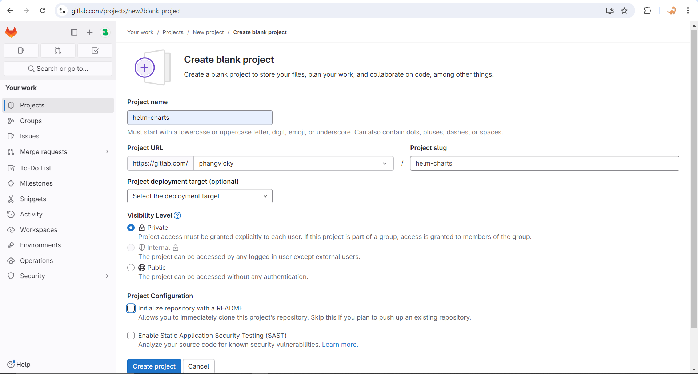

# Helm Chart Repository on Gitlab Package Registry 🐺

[](https://github.com/vickyphang/helm-charts-on-gitlab/blob/main/LICENSE)


<p align="center">  </p>

### Why Helm?
Applying YAML configuration files can get overwhelming, especially when needing to deploy into several environments or wanting to version the manifests. It is also cumbersome to maintain plain YAML files for more complex deployments which can easily extend to more than 1000 lines per file.

### Prerequisites
- Ubuntu VM
- Helm 3
- Helm plugin: [cm-push](https://github.com/chartmuseum/helm-push#install)
- Git

## 1. Setup Gitlab
- Create new project / repository
    <p align="center">  </p>
- Generate Access Token
    - Click on your profile picture on the upper left, then click **Edit profile**
    - On the left side, click **Access Token** then **Add new token**
        <p align="center">  </p>
    - Give appropriate permission for this token. What must be enabled are: `read_repository`, `write_repository`, `read_registry`, and `write_registry`
    - Copy and store your newly created Access Token on a safe place

## 2. Create Helm Chart
- Clone gitlab repository
    ```bash
    # clone repository
    git clone https://gitlab.com/phangvicky/helm-charts.git

    # change directory into repo
    cd helm-charts
    ```
- Manually create helm chart structure
    ```bash
    mkdir Charts
    mkdir Charts/app-1
    touch Charts/app-1/Chart.yaml
    touch Charts/app-1/values.yaml
    mkdir Charts/app-1/templates
    touch Charts/app-1/templates/_helpers.tpl
    touch Charts/app-1/templates/serviceaccount.yaml
    touch Charts/app-1/templates/deployment.yaml
    touch Charts/app-1/templates/service.yaml
    mkdir packages
    ```
-  Package the Helm Chart
    ```bash
    # package app-1
    helm package Charts/app-1 --destination packages
    ```
- Generate helm repo index
    
    A valid chart repository must have an **index file**. The index file contains information about each chart in the chart repository. The `helm repo index` command will generate an index file based on a given local directory that contains packaged charts.
    ```bash
    # generate index.yaml for packaged charts inside folder 'packages'
    # for the url, you just need to copy the project id of your helm-charts repository
    helm repo index . --url https://gitlab.com/api/v4/projects/<gitlab-project-id>/packages/helm/stable
    ```
- Commit and push all changes to Gitlab repository
- Publish helm-chart package
    - Add your helm repostiory
        ```bash
        helm repo add --username <username> --password <access-token> <repo-name> https://gitlab.example.com/api/v4/projects/<project-id>/packages/helm/stable

        # example
        helm repo add --username userv --password glpat-userv-token vicky https://gitlab.com/api/v4/projects/12345678/packages/helm/stable
        ```
    - Push the package
        ```bash
        helm cm-push packages/<package-name>.tgz <repo-name>

        # example
        helm cm-push packages/app-1-1.0.0.tgz vicky
        ```
- Verify your helm repo
    - Update helm repo
        ```bash
        helm repo update
        ```
    - List helm repo, and you should get your repo name listed
        ```bash
        # list helm repo
        helm repo ls

        # output
        NAME        URL
        vicky       https://gitlab.com/api/v4/projects/12345678/packages/helm/stable
        ```
    - Search for published charts inside your repo
        ```bash
        helm search repo vicky

        # output
        NAME            CHART VERSION       APP VERSION     DESCRIPTION
        vicky/app-1     1.0.0               1.0.0           A Helm chart for Kubernetes
        ```

## References
- [Helm Chart Repository with GitHub Pages](https://intverse.medium.com/helm-chart-repository-with-github-pages-225b0b01195c)
- [The Chart Repository Guide](https://helm.sh/docs/topics/chart_repository/)
- [Helm charts in the package registry](https://docs.gitlab.com/ee/user/packages/helm_repository/)
- [Get started with GitLab's Helm Package Registry](https://about.gitlab.com/blog/2021/10/18/improve-cd-workflows-helm-chart-registry/)


